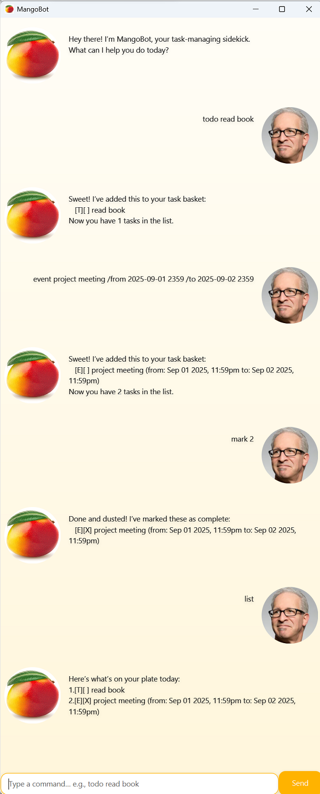

# MangoBot — User Guide

> Your task-managing sidekick.

  

---

## Table of Contents
- [What is MangoBot?](#what-is-mangobot)
- [Quick Start](#quick-start)
- [Commands](#commands)
  - [todo](#todo)
  - [deadline](#deadline)
  - [event](#event)
  - [list](#list)
  - [mark / unmark](#mark--unmark)
  - [delete](#delete)
  - [find](#find)
  - [bye](#bye)
- [Date/Time Format](#datetime-format)
- [Examples](#examples)
- [Storage](#storage)

---

## What is MangoBot?

MangoBot is a small task manager that runs in a chat-style UI or in the console. It supports simple tasks, due-dated deadlines and events. Tasks are saved locally to a text file so they persist across sessions.

---

## Quick Start

When MangoBot opens, type a command (see below) and click on **Send** or press **Enter**. Your tasks are saved to `./data/mango.txt`.

---

## Commands

> [!IMPORTANT]
> Commands are **lowercase** and start the line. Arguments follow after a space.

### `todo`
Add a simple task without a date.
```
todo <description>
```
**Example:** `todo buy milk`

---

### `deadline`
Add a task due at a specific date/time.
```
deadline <description> /by <yyyy-MM-dd HHmm>
```
**Example:** `deadline return book /by 2019-12-02 1800`

---

### `event`
Add a task with a start and end time.
```
event <description> /from <yyyy-MM-dd HHmm> /to <yyyy-MM-dd HHmm>
```
**Example:** `event project meeting /from 2025-01-15 1400 /to 2025-01-15 1530`

---

### `list`
Show all tasks with their index.
```
list
```

---

### `mark` / `unmark`
Mark one or more tasks as done or not done. Accepts one or more **1-based** indices separated by spaces.
```
mark <i1> [i2 ...]
unmark <i1> [i2 ...]
```
**Example:** `mark 2 4`

---

### `delete`
Remove one or more tasks. Accepts one or more **1-based** indices separated by spaces.
```
delete <i1> [i2 ...]
```
**Example:** `delete 3`

---

### `find`
Search for tasks containing a keyword (case-sensitive match on description).
```
find <keyword>
```
**Example:** `find book`

---

### `bye`
Exit the app.
```
bye
```

---

## Date/Time Format

- Pattern: **`yyyy-MM-dd HHmm`**  
  Examples: `2025-12-31 0900`, `2019-12-02 1800`
- MangoBot validates dates; invalid input shows an error with a suggested format.

---

## Examples

```text
todo draft report
deadline submit report /by 2025-03-21 1700
event team sync /from 2025-03-22 1000 /to 2025-03-22 1030
list
mark 1 3
find report
delete 2
bye
```

## Storage

- File: `./data/mango.txt`
- Format (one task per line):
  ```
  T | <0|1> | <description>
  D | <0|1> | <description> | yyyy-MM-dd HHmm
  E | <0|1> | <description> | yyyy-MM-dd HHmm | yyyy-MM-dd HHmm
  ```
  - `T` = Todo, `D` = Deadline, `E` = Event
  - `0` = not done, `1` = done

> [!NOTE]
> You can back up or reset your tasks by copying/deleting this file while the app is closed.
